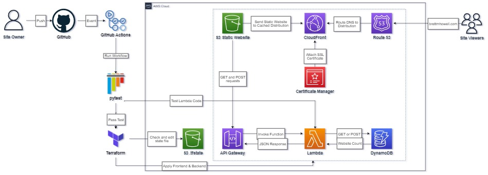

# Cloud_Resume_Challenge

[Cloud Resume Challenge](https://cloudresumechallenge.dev/docs/the-challenge/aws/)
  by Forrest Brazeal

The Cloud Resume Challenge is designed as way for newcomers to cloud to get hands on experience with some of the technologies that are commonly used in the day to day of DevOps Engineers. Brazeal purposely only gives a basic overview of the steps you're required to take to complete the challenge. This is meant to incourage self learning. High-level guidance is given on things like Frontend Development, HTTPS, DNS, API's, Testing, IaC, and CI/CD.

  You can view my website at: [brettmhowell.com](https://brettmhowell.com)

  While you can also use Azure or GCP, my website is implementied using AWS resources such as: S3, CloudFront, Route 53, API Gateway, Lambda, and DynamoDB.

 To deploy the architecture I used Terraform as my Infrastructure as Code method and GitHub Actions as my CI/CD method. 

  Please feel free to view to diagram of the architecture below:

 

Challenge Steps

**1. Certification**
- I earned my AWS Solutions Architect Associate certification before I came across this challenge using Adrian Cantril's course. [Credly](https://www.credly.com/badges/e31ed85f-3621-4277-bcb0-283092783d11/public_url)

**2. HTML**
- Utlized a free Udemy course on HTML and wrote it up in VSC

**3. CSS**
- Similarlly to step 2 I utilized a free Udemy course to learn CSS basics.
- I ended up finding a template online and editing it to my needs

**4. Static Website**
- Stored my web files in an S3 Bucket and launched it as a static website

**5. HTTPS**
- Used CloudFront to enable HTTPS and caching at edge locations

**6. DNS**
- Route 53 was utilized to create my domain name (brettmhowell.com)
- Attached an SSL Certificate to CloudFront for alternate names

**7.  Javascript**
- Created a  simple script.js for my website to use the API Gateway that is created in later steps

**8. Database**
- Utilized DynamoDB to store my website view count
- On-Demand pricing was necessary to make usage of the database essentially free
- Holds a single attribute which will be updated by the Lambda function

**9. API**
- Rest API allows access to URL endpoint to accept GET and POST methods
- When API URL is accessed the Lambda function is invoked, returning data from DynamoDB table
- CORS Enabled

**10. Python**
- Lambda function written using Python
- Utilizes boto3 library for AWS

**11. Tests**
- Tested Lambda function using JSON in Lambda dashboard
- Tested GET and POST methods directly in API Gateway dashboard 

**12. Infrastructure as Code**
- Terraform used as IaC method, split into two configurations, Frontend and Backend
- Configured to use S3 as storage for the state file
- All resources created in Terraform with the exception of S3 bucket for .tfstate, Route 53 Hosted Zone and the required SSL Certificate

**13. Source Control**
- This repository created in GitHub in order to implement CI/CD

**14. CI/CD Backend**
- GitHub Actions Workflow created to use Terraform apply whenever a file in the backend directory is updated
- Workflow tests Lambda Function whenever there is a change to Python code and compresses the .py file into a .zip file to send into AWS

**15. CI/CD Frontend**
- 2nd GitHub Actions Workflow created to use Terraform apply whenever a file in the frontend directory is updated whether it be a .tf file or a file for the website (html, css, js)

**16. Blog post**
- Create a blog post detailing my experience with the Cloud Resume Project (Still in progress)
